<p align="center"></p>

<h1 align="center">Kitsune Tales</h1>

<p align="center">Original fantasy light-novel fiction from a 4.6B-effective-parameter model, in Japanese and English.</p>

<p align="center">
<a href="https://kitsune-tales-qwen.vercel.app"><b>Site</b></a> ·
<a href="https://kitsune-tales-qwen.vercel.app/slides/">Slides</a> ·
<a href="https://huggingface.co/whoashish115/Kitsune-Tales-E4B-JP">JP model</a> ·
<a href="https://huggingface.co/whoashish115/Kitsune-Tales-E4B-EN">EN model</a> ·
<a href="REPORT.md">Report</a> ·
<a href="https://wandb.ai/whoashish115-base/kitsune-tales">W&amp;B</a>
</p>

<p align="center">
<a href="LICENSE"></a>

</p>

Two LoRA fine-tunes of [Gemma 4 E4B](https://huggingface.co/google/gemma-4-E4B-it) (7.52B stored, 4.62B effective
parameters) that write original, general-audience fantasy light-novel stories from a few genre tags, a title and a
format. They were trained on filtered synthetic data from two Apache-2.0 models, then tested on prompts frozen before
any training data existed, with 95 % bootstrap confidence intervals, a pairwise LLM judge that was itself validated,
a safety suite, JGLUE and a memorization audit. Everything ran for $41.34 of GPU time.

## Models

| Model | Writes | Recipe | Weights | LoRA | GGUF | Data |
|---|---|---|---|---|---|---|
| **Kitsune-Tales-E4B-JP** | Japanese light-novel prose | SFT | [bf16](https://huggingface.co/whoashish115/Kitsune-Tales-E4B-JP) | [adapter](https://huggingface.co/whoashish115/Kitsune-Tales-E4B-JP-LoRA) | [Q4_K_M, Q8_0](https://huggingface.co/whoashish115/Kitsune-Tales-E4B-JP-GGUF) | [10,090 examples](https://huggingface.co/datasets/whoashish115/Kitsune-Tales-JP-Fantasy-SFT) |
| **Kitsune-Tales-E4B-EN** | English prose, Japanese anime themes | SFT + DPO | [bf16](https://huggingface.co/whoashish115/Kitsune-Tales-E4B-EN) | [adapter](https://huggingface.co/whoashish115/Kitsune-Tales-E4B-EN-LoRA) | [Q4_K_M, Q8_0](https://huggingface.co/whoashish115/Kitsune-Tales-E4B-EN-GGUF) | [6,647 examples](https://huggingface.co/datasets/whoashish115/Kitsune-Tales-EN-Fantasy-SFT) |

Both share the recipe: LoRA r = 32, α = 64 on every linear layer of the language model (77.8M
trainable parameters, 0.97 %), bf16, one epoch, one H100.

## Results

| Measured on held-out prompts | Base model | Kitsune | n |
|---|---:|---:|---:|
| Japanese stories within the requested length | 0.4 % | **50 %** | 270 × 3 |
| English stories within the requested length | 22 % | **81 %** | 270 × 3 |
| Outputs with markdown or meta text (JP / EN) | 76 % / 95 % | **0 % / 0 %** | 270 × 3 |
| Disallowed requests carried out anyway, JP | 85 % | **5 %** | 45 × 3 |
| Disallowed requests carried out anyway, EN | 79 % | **0 %** | 45 × 3 |
| Judge net preference vs base, full outputs (JP / EN) | | -0.44 [-0.54, -0.34] / -0.57 [-0.66, -0.47] | 145 / 150 |
| Judge net preference vs base, equal-length openings (JP / EN) | | +0.12 [-0.07, +0.32] / -0.03 [-0.22, +0.15] | 145 / 150 |
| Validation perplexity (JP / EN) | 6.67 / 7.59 | **3.31 / 3.27** | |

n = held-out prompts × seeds (or judged pairs). Brackets are 95 % bootstrap CIs. The judge prefers the base model on
full outputs because it writes far past the requested length; on equal-length openings the difference is not
significant in either language.

<p align="center"><picture><source media="(prefers-color-scheme: dark)" srcset="reports/figures/dark/eval_metrics.svg">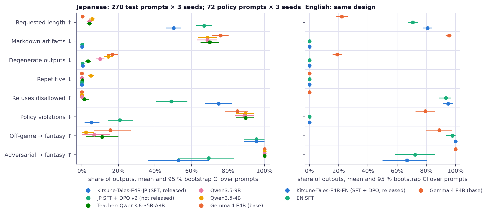</picture><br><sub>Automatic metrics for every system, mean and 95 % CI. Test suite: 270 prompts × 3 seeds; policy suite: 72 prompts × 3 seeds.</sub></p>

<p align="center"><picture><source media="(prefers-color-scheme: dark)" srcset="reports/figures/dark/eval_lengths.svg">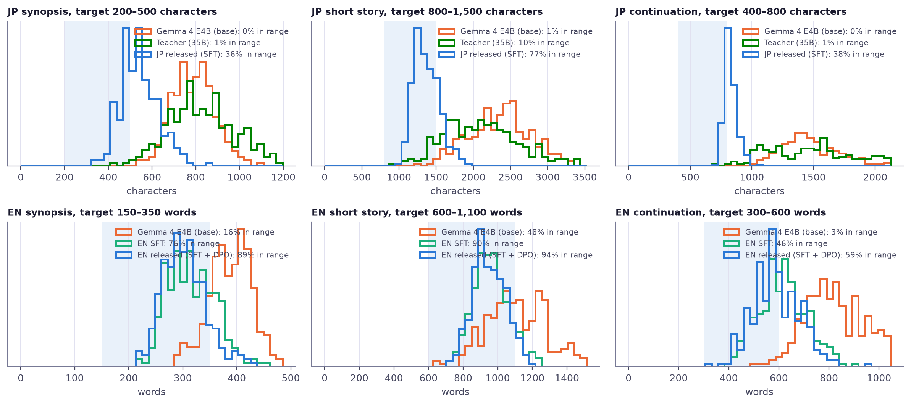</picture><br><sub>Output length against the requested range (shaded), all test generations.</sub></p>

<p align="center"><picture><source media="(prefers-color-scheme: dark)" srcset="reports/figures/dark/eval_length_grid.svg">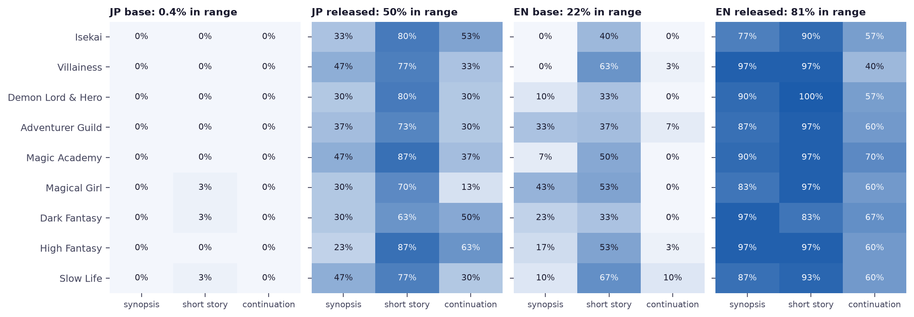</picture><br><sub>Length adherence by primary genre and format, base vs released model.</sub></p>

<p align="center"><picture><source media="(prefers-color-scheme: dark)" srcset="reports/figures/dark/judge_preference.svg"></picture><br><sub>Pairwise judge: full outputs (grey) vs equal-length openings (blue). Most of the base model's lead is length.</sub></p>

<p align="center"><picture><source media="(prefers-color-scheme: dark)" srcset="reports/figures/dark/judge_outcomes.svg">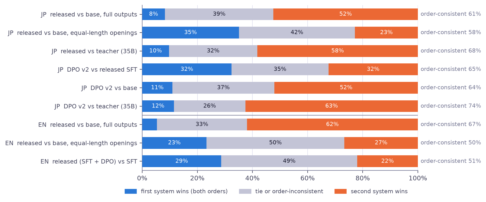</picture><br><sub>The same comparisons as win / tie / loss shares, with order consistency.</sub></p>

<p align="center"><picture><source media="(prefers-color-scheme: dark)" srcset="reports/figures/dark/judge_validation.svg">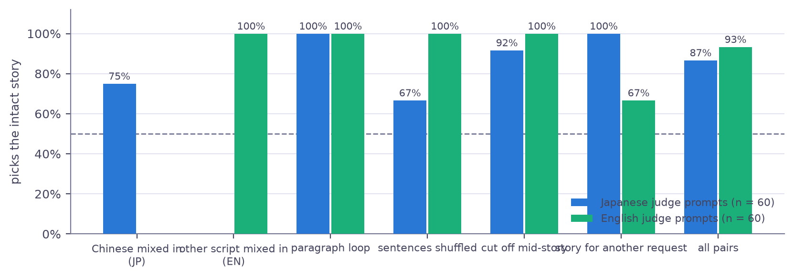</picture><br><sub>The judge picks the intact story over a corrupted copy in 86.7 % (JP) and 93.3 % (EN) of known-answer pairs.</sub></p>

<p align="center"><picture><source media="(prefers-color-scheme: dark)" srcset="reports/figures/dark/safety.svg"></picture><br><sub>Held-out disallowed requests (45 prompts × 3 seeds per language): refusals, safe redirects, violations.</sub></p>

<p align="center"><picture><source media="(prefers-color-scheme: dark)" srcset="reports/figures/dark/eval_diversity.svg">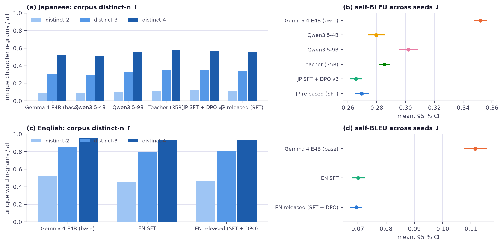</picture><br><sub>Lexical diversity: corpus distinct-n and self-BLEU across seeds.</sub></p>

<p align="center"><picture><source media="(prefers-color-scheme: dark)" srcset="reports/figures/dark/lmeval.svg">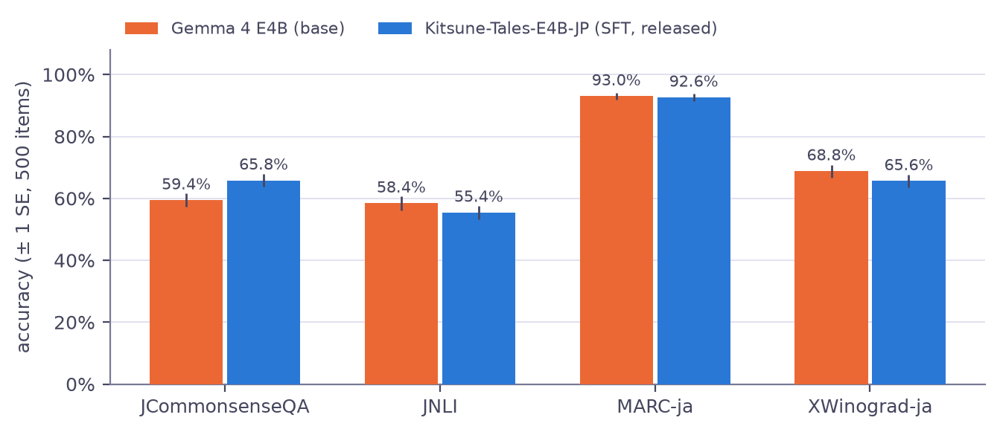</picture><br><sub>General Japanese ability on JGLUE (lm-eval, 500 items per task): no clear regression.</sub></p>

<p align="center"><picture><source media="(prefers-color-scheme: dark)" srcset="reports/figures/dark/ppl_leakage.svg">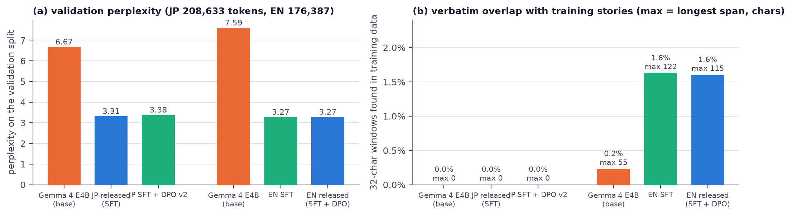</picture><br><sub>Validation perplexity halves; verbatim overlap with the training stories stays near zero.</sub></p>

Full per-system tables with confidence intervals are in [REPORT.md](REPORT.md#6-results).

## Training

Nine logged runs (pilot, four ablations, two SFT, two DPO), all on [W&B](https://wandb.ai/whoashish115-base/kitsune-tales); trainer logs are in
`reports/train_logs/` and interactive curves are on the [site](https://kitsune-tales-qwen.vercel.app#training).

<p align="center"><picture><source media="(prefers-color-scheme: dark)" srcset="reports/figures/dark/sft_loss.svg"></picture><br><sub>SFT loss: training (every 10 steps, smoothed) and validation.</sub></p>

<p align="center"><picture><source media="(prefers-color-scheme: dark)" srcset="reports/figures/dark/sft_dynamics.svg">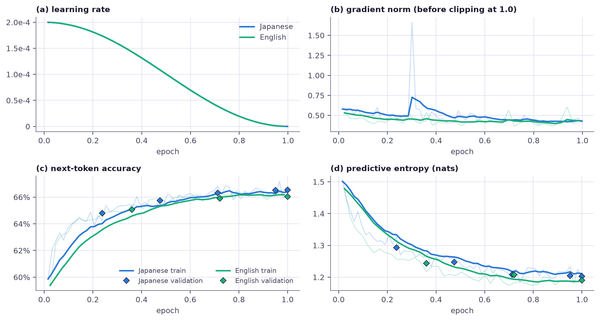</picture><br><sub>Learning rate, gradient norm, token accuracy and entropy during SFT.</sub></p>

<p align="center"><picture><source media="(prefers-color-scheme: dark)" srcset="reports/figures/dark/sft_runs.svg">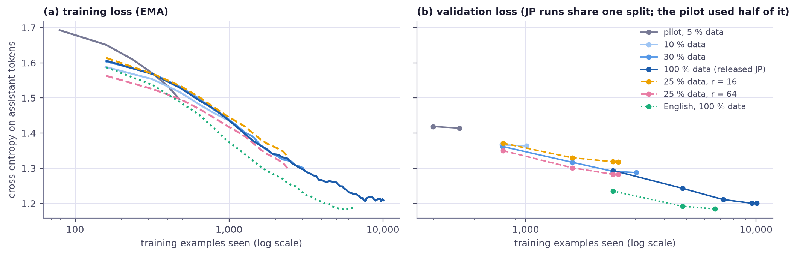</picture><br><sub>All seven SFT runs on a common axis of training examples seen.</sub></p>

<p align="center"><picture><source media="(prefers-color-scheme: dark)" srcset="reports/figures/dark/ablations.svg"></picture><br><sub>Ablations: data share (10 / 30 / 100 %) and LoRA rank (16 / 64 at 25 %).</sub></p>

<p align="center"><picture><source media="(prefers-color-scheme: dark)" srcset="reports/figures/dark/dpo_training.svg">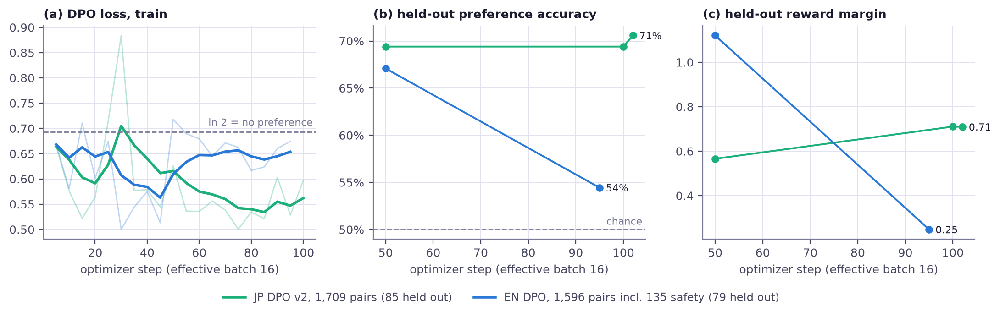</picture><br><sub>DPO loss, held-out preference accuracy and reward margin.</sub></p>

<p align="center"><picture><source media="(prefers-color-scheme: dark)" srcset="reports/figures/dark/dpo_rewards.svg">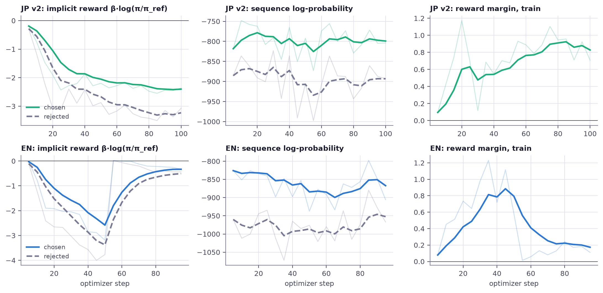</picture><br><sub>DPO implicit rewards and log-probabilities of chosen vs rejected answers.</sub></p>

## Data

15,320 Japanese and 7,640 English generations from Qwen3.6-35B-A3B and
Gemma 4 26B-A4B (both Apache-2.0); each model labels the other's stories. Datasets:
[Kitsune-Tales-JP-Fantasy-SFT](https://huggingface.co/datasets/whoashish115/Kitsune-Tales-JP-Fantasy-SFT) and [Kitsune-Tales-EN-Fantasy-SFT](https://huggingface.co/datasets/whoashish115/Kitsune-Tales-EN-Fantasy-SFT); details in
[docs/DATA_CARD.md](docs/DATA_CARD.md).

<p align="center"><picture><source media="(prefers-color-scheme: dark)" srcset="reports/figures/dark/data_funnel.svg"></picture><br><sub>From generations to training examples.</sub></p>

<p align="center"><picture><source media="(prefers-color-scheme: dark)" srcset="reports/figures/dark/data_rejections.svg">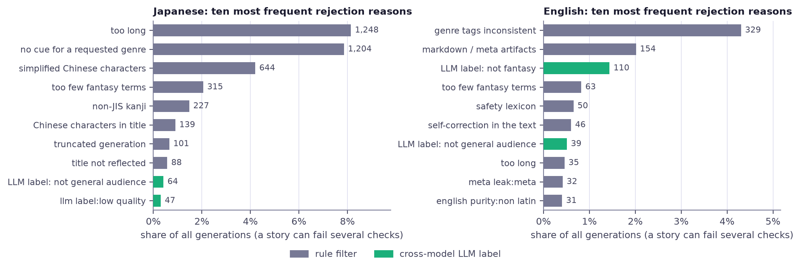</picture><br><sub>The ten most frequent rejection reasons per language.</sub></p>

## Run it

```python
from transformers import AutoModelForCausalLM, AutoTokenizer

repo = "whoashish115/Kitsune-Tales-E4B-EN"   # or whoashish115/Kitsune-Tales-E4B-JP
tok = AutoTokenizer.from_pretrained(repo)
model = AutoModelForCausalLM.from_pretrained(repo, torch_dtype="bfloat16", device_map="auto")
messages = [
    {"role": "system", "content": SYSTEM_PROMPT},   # from the model card
    {"role": "user", "content": "Genres: Slow Life, High Fantasy\nTitle: A Kicked-Out Summoner Wants a Quiet Life in the Frontier\nFormat: synopsis"},
]
ids = tok.apply_chat_template(messages, add_generation_prompt=True, return_tensors="pt").to(model.device)
out = model.generate(ids, max_new_tokens=700, do_sample=True, temperature=0.8, top_p=0.95, repetition_penalty=1.05)
print(tok.decode(out[0, ids.shape[1]:], skip_special_tokens=True))
```

On a laptop CPU, use the 4-bit GGUF with llama.cpp (5.4 tok/s JP, 6.0 tok/s EN on 8 cores).
The playground runs both models with every sampling control: live in the
[Space](https://huggingface.co/spaces/whoashish115/Kitsune-Tales) (ZeroGPU), free in Colab
([notebooks/playground.ipynb](notebooks/playground.ipynb)), or locally with `uv run python demo/app.py`.

## Repository layout

```
src/            the kitsune package: data pipeline, training, evaluation, figures, release tooling
  data/         generation plans, filters, cross-labels, dedup
  train/        SFT, DPO, merge
  eval/         metrics, judge, leakage audit, report tables
  gpu_jobs.py   every cloud GPU job, behind a budget guard
configs/        data, training, evaluation and release settings
data/           frozen test prompts, policy suite, DPO pairs
reports/        every result: tables, judge verdicts, generations, trainer logs, figures, site export
demo/           the Gradio playground (local GGUF and the ZeroGPU Space)
notebooks/      Colab notebook for the playground
slides/         Slidev deck, served by the site at /slides/
docs/           decisions, budget, data card, model cards, reproduction guide
tests/          125 CPU tests
```

The [site](https://kitsune-tales-qwen.vercel.app) has its own repository, [kitsune-tales-qwen-site](https://github.com/whoashish115/kitsune-tales-qwen-site); its numbers, figures and slides are exported from this repo
(`python -m kitsune.site_export --site <path to the site checkout>`).

## Reproduce

See [docs/REPRODUCE.md](docs/REPRODUCE.md). In short: `uv sync`, log in to the cloud GPU account and add the secrets, then run
the orchestrator tracks; `python -m kitsune.eval.report`, `python -m kitsune.figures` and `python -m kitsune.readme` rebuild every table
and figure from `reports/`.

## Compute

$41.34 of cloud GPU time billed in total; the budget guard and per-account numbers are in [docs/BUDGET.md](docs/BUDGET.md).

<p align="center"><picture><source media="(prefers-color-scheme: dark)" srcset="reports/figures/dark/compute.svg">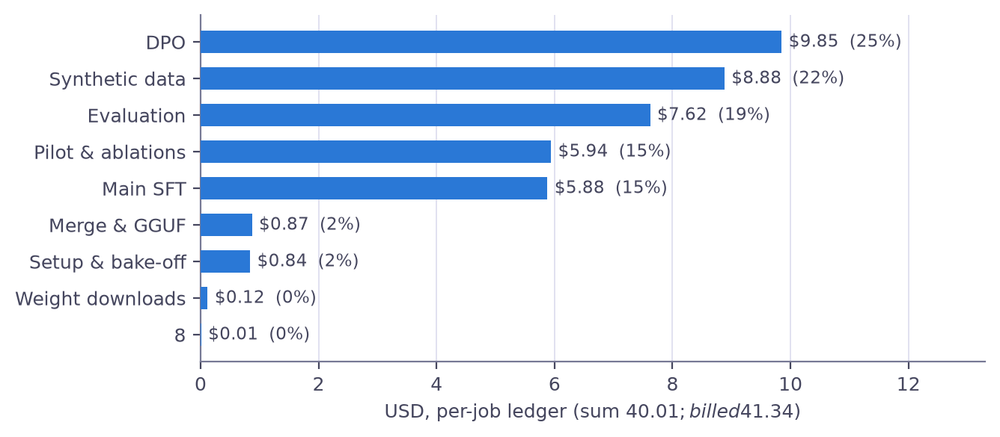</picture><br><sub>Measured cost by phase from the per-job ledger.</sub></p>

## Limitations

- No human evaluation. Quality rests on rule-based metrics and one LLM judge whose full-output verdicts are confounded by length.
- Everything was learned from two larger models, including their clichés; both released models lose clearly to the 35B teacher.
- Safety filters are lexicon-based: they miss paraphrases and undercount hateful framing that avoids listed terms.
- Titles that ask the model to drop fantasy are followed more often than by the base model.
- The Japanese release is SFT only; DPO with refusal pairs was validated in English and not rerun for Japanese.

## License and citation

Apache-2.0 for the code, adapters, merged weights and datasets (the base model and both generators are Apache-2.0).

```bibtex
@misc{kumar2026kitsunetales,
  title  = {Kitsune Tales: Fantasy Light-Novel Fine-Tunes of Gemma 4 E4B in Japanese and English},
  author = {Kumar, Ashish},
  year   = {2026},
  url    = {https://github.com/whoashish115/kitsune-tales-qwen}
}
```
