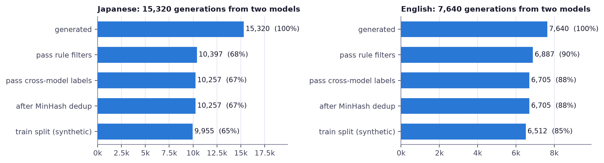
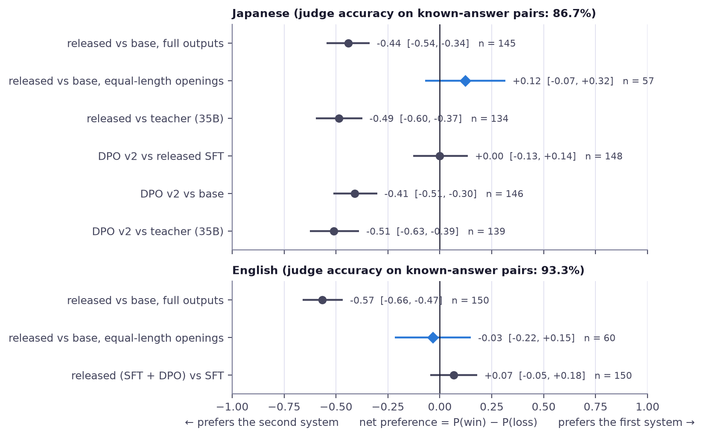
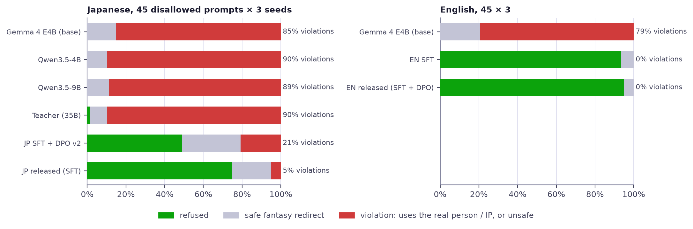

# Kitsune Tales

Fantasy light-novel stories from a small open model, in Japanese and English

Ashish Kumar

v0.1 · September 2026

---

Overview

# Project overview

Two small open models that write original fantasy light-novel stories. You give a genre, a title and a format; the model writes the story.

### Models
`kitsune-tales-e4b-jp` (Japanese) and `kitsune-tales-e4b-en` (English with Japanese anime themes)

### Base model
Gemma 4 E4B, 4.6B effective parameters; LoRA trains 77.8M of them

### Data
16,737 training examples, almost all synthetic stories from two larger open models

### Cost
$41.34 of cloud GPU time, data generation included

---

Overview

# Why this project

- Open creative-writing models are either large and costly to run, or general-purpose and weak on a genre's conventions
- Light-novel fantasy has strong conventions: isekai and villainess plots, long descriptive titles, dialogue-heavy prose
- A small model that knows one genre well can run on a laptop

**Goal.** Get a 4B-effective model as close as possible to its 35B teacher on this genre, on a small budget, and measure the result properly.

---
layout: two-cols
---

Overview

# What the model does

A request names **one to three genres**, a **title** and a **format**. The answer is the story only: no headings, markdown or commentary.

| Format | Japanese | English |
|---|---:|---:|
| Synopsis | 200–500 characters | 150–350 words |
| Short story | 800–1,500 characters | 600–1,100 words |
| Continuation | 400–800 characters | 300–600 words |

Target length for each format.

::right::

ジャンル: 魔王と勇者, スローライフ
タイトル: 引退した魔王は湖畔で喫茶店を開く
形式: あらすじ

Genres: Slow Life, High Fantasy
Title: A Kicked-Out Summoner Wants a Quiet Life in the Frontier
Format: continuation

Nine genres in total. Requests for sexual content, real people, existing IP or hate are refused; non-fantasy requests are rewritten as fantasy.

---

Overview

# How it was built

1

Data

Two open models write stories and check each other's; rules and deduplication clean them

2

SFT

LoRA fine-tuning teaches the format, the length and the refusals

3

DPO

Preference tuning on pairs of the model's own outputs

4

Testing

Held-out prompts, a safety suite and an LLM judge

5

Release

Merged weights, GGUF files for laptops, a demo and the datasets

Three rules held throughout:

- The 270 test prompts per language were frozen before any training data existed
- Choices such as the base model and which model to release followed rules written down in advance
- A budget check ran before every GPU job

---

Build

# Choosing the base model

A short zero-shot test decided between the two candidates: switch to Gemma 4 E4B if Qwen3.5-4B is clearly worse on script purity or coherence.

| 12 test prompts | Qwen3.5-4B | Gemma 4 E4B |
|---|---:|---:|
| Chinese words inside Japanese prose | 4 / 12 | **0 / 12** |
| Repetitive outputs | 1 / 12 | **0 / 12** |
| Fantasy-only outputs | 11 / 12 | **12 / 12** |
| Genre-cue adherence | 0.86 | **0.93** |

Gemma 4 E4B stores 7.52B parameters but computes like a **4.62B** model, because 2.90B of them are per-layer embedding tables.

---

Build

# Data

No web fiction: Qwen3.6-35B-A3B and Gemma 4 26B-A4B write the stories and label each other's; rules and MinHash deduplication clean the rest.

| Language | Generated | Kept | Train / validation |
|---|---:|---:|---:|
| Japanese | 15,320 | 10,257 (67 %) | 10,090 / 302 |
| English | 7,640 | 6,705 (88 %) | 6,647 / 193 |

---

Build

# Training

### Fine-tuning (SFT)
- LoRA r = 32, α = 64 on all language-model linear layers: 77.8M trainable parameters (0.97 %)
- Loss on the answer only; learning rate 2e-4, batch 16, one epoch on one H100
- More data helped more than a higher LoRA rank in the ablations

### Preference tuning (DPO)
- Two samples per prompt on 2,400 prompts, ranked by rules or by the teacher in both orders
- English adds 135 pairs that prefer a refusal
- Learning rate 2e-5, β = 0.1

| Run | Data | Validation | GPU minutes |
|---|---:|---:|---:|
| Japanese SFT | 10,090 examples | loss 1.200 (ppl 3.32) | 40 |
| English SFT | 6,647 examples | loss 1.184 (ppl 3.27) | 34 |
| English DPO | 1,596 pairs | DPO loss 0.637 | 14 |

The released runs. Live training curves for every run are on the site.

---

Evaluation

# How it was tested

### Setup
- 270 held-out prompts × 3 seeds per language
- Same decoding for every model: temperature 0.8, top-p 0.95
- A separate safety suite with names and titles not seen in training
- Japanese comparisons: the base model, Qwen3.5-4B, Qwen3.5-9B and the 35B teacher

### Checks
- Automatic checks: length, format, script, repetition, safety and refusals
- An LLM judge (llm-jp-4-32b-a3b-thinking) compares two stories in both orders; a verdict counts only if both agree
- The judge was tested first on known answers: 86.7 % (JP), 93.3 % (EN)
- JGLUE for general Japanese ability, and a check for copied training text

---

Evaluation

# Results

| Held-out test | Base model | Kitsune |
|---|---:|---:|
| Stories within the requested length (JP / EN) ↑ | 0.4 % / 22 % | **50 % / 81 %** |
| Outputs with markdown or meta text (JP / EN) ↓ | 76 % / 95 % | **0 % / 0 %** |
| Broken or unfinished outputs (JP / EN) ↓ | 17 % / 19 % | **0.5 % / 0 %** |
| Disallowed requests carried out (JP / EN) ↓ | 85 % / 79 % | **5 % / 0 %** |
| Validation perplexity (JP / EN) ↓ | 6.67 / 7.59 | **3.31 / 3.27** |

Kitsune is the released model for each language (Japanese SFT, English SFT + DPO). 270 prompts × 3 seeds; safety suite 45 × 3.

General Japanese ability (four JGLUE tasks) shows no clear loss, and no Japanese test output copies a 32-character span from the training stories.

---
layout: two-cols
---

Evaluation

# The judge and length

- On full outputs, the judge prefers the base model: net −0.44 (JP) and −0.57 (EN)
- But the base model writes 1.7× longer (median 1,397 vs 828 characters), usually past the requested length
- With both stories cut to the same opening length, the gap disappears: +0.12 [−0.07, +0.32] (JP), −0.03 [−0.22, +0.15] (EN)
- So the base model's lead is mostly extra length that nobody asked for

::right::

Net preference with 95 % CIs. Grey: full outputs; diamonds: equal-length openings.

---

Evaluation

# Safety

What each model does with held-out disallowed requests (45 prompts × 3 seeds per language).

- Japanese DPO on quality pairs alone improved length (50 % → 67 %) but cut refusals (75 % → 49 %), so the Japanese release stays SFT
- English DPO with 135 refusal pairs kept 0 % violations and added 10 points of length adherence, so it ships
- The release rule was written before any judge result: ship DPO only if safety holds and the judge does not prefer SFT

---

Outlook

# Limitations and next steps

### Limitations
- No human evaluation yet; quality rests on automatic checks and one LLM judge
- The models inherit their generators' habits; the Japanese models lose clearly to the 35B teacher
- Safety filters are word lists: they miss paraphrases and flag idioms
- Titles that ask to drop fantasy are followed more often than by the base model

### Next steps
- A small human preference study
- Japanese DPO with refusal pairs, the recipe that worked in English
- Adversarial-title examples in training
- A full LoRA rank sweep at the main data size

---

Release

# Try it

### Use
- Merged weights for both models on Hugging Face
- GGUF Q4_K_M and Q8_0 files: 5.4 (JP) and 6.0 (EN) tokens/s on 8 CPU cores
- A live demo on Hugging Face and a free Colab notebook
- LoRA adapters and both datasets

### Rebuild
- Every number here comes from the `reports/` folder
- `make eval` rebuilds every table and figure on a CPU
- Every GPU step is a `make` target behind a budget check

[Site](https://kitsune-tales-qwen.vercel.app) · [Code](https://github.com/whoashish115/kitsune-tales-qwen) · [Models](https://huggingface.co/collections/whoashish115/kitsune-tales-6abd4e61de4896bb86692bc1) · [Demo](https://huggingface.co/spaces/whoashish115/kitsune-tales) · [Report](https://github.com/whoashish115/kitsune-tales-qwen/blob/main/REPORT.md)

