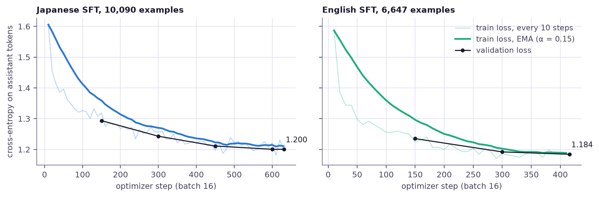
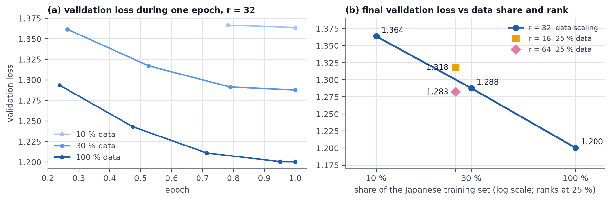

# Kitsune Tales

Fantasy light-novel fine-tunes of Gemma 4 E4B, in Japanese and English

Ashish Kumar · v0.1 · 2026

---

# In one slide

- Two LoRA fine-tunes of a **4.6B-effective** open model: Japanese (SFT) and English (SFT + DPO)
- Trained only on **filtered synthetic data** from Apache-2.0 models
- They follow the request: length adherence **0.4 % → 50 %** (JP) and **22 % → 81 %** (EN)
- They refuse what they should: policy violations **85 % → 5 %** (JP) and **79 % → 0 %** (EN)
- Prose is **on par with the base model** once both outputs have the same length
- End to end, data included: **$41.34** of cloud GPU time

---

# Why

- Open creative-writing models are either **large** (costly to run) or **general** (weak on a genre's conventions)
- Light-novel fantasy is a large genre with strong conventions: isekai, villainess, slow life; long descriptive titles; dialogue-heavy prose
- That makes it a good target for a **small, specialised** model that runs on a laptop

**Question.** How close can a 4B model get to its 35B teacher on this task, on an individual's budget, measured honestly?

---
layout: two-cols
---

# The task

A request names **1–3 genres**, a **title** and a **format**. The answer is prose only: no headings, no markdown, no commentary.

| Format | Japanese | English |
|---|---:|---:|
| synopsis | 200–500 chars | 150–350 words |
| short story | 800–1,500 chars | 600–1,100 words |
| continuation | 400–800 chars | 300–600 words |

Nine genres: Isekai, Villainess, Demon Lord & Hero, Adventurer Guild, Magic Academy, Magical Girl, Dark Fantasy, High Fantasy, Slow Life.

::right::

ジャンル: 魔王と勇者, スローライフ
タイトル: 引退した魔王は湖畔で喫茶店を開く
形式: あらすじ

Genres: Slow Life, High Fantasy
Title: A Kicked-Out Summoner Wants a Quiet Life in the Frontier
Format: continuation

Requests for sexual content, real people, existing IP or hate are refused. Non-fantasy requests are rewritten as fantasy.

---

# Ground rules

Decided before any training data existed.

### Frozen test set
270 prompts per language (9 genres × 3 formats × 10), hashed and frozen first.

### Pre-registered choices
Base-model switch rule and model-release rule fixed before the results they decide.

### Honest numbers
95 % bootstrap CIs everywhere; the LLM judge must pass a known-answer test first.

### Open and cheap
Apache-2.0 models, code and data; a budget guard checks every GPU job before launch.

---

# Base model

A zero-shot bake-off with a rule written in advance: switch from Qwen3.5-4B to Gemma 4 E4B if Qwen is clearly worse on script purity or coherence.

| 12 held-out prompts | Qwen3.5-4B | Gemma 4 E4B |
|---|---:|---:|
| Chinese words inside Japanese prose | 4 / 12 | **0 / 12** |
| Repetitive outputs | 1 / 12 | **0 / 12** |
| Fantasy-only | 11 / 12 | **12 / 12** |
| Genre-cue adherence | 0.86 | **0.93** |

**Gemma 4 E4B**: 7.52B parameters stored, but 2.90B of them are per-layer embedding tables, so it computes like a **4.62B** model. Apache-2.0, mature llama.cpp support.

---

# Data

No web fiction. Two Apache-2.0 models write the stories; each labels the other's.

01

Seeds

Titles, genre mixes and formats; titles close to a test title are dropped

02

Generate

Qwen3.6-35B-A3B and Gemma 4 26B-A4B write the stories

03

Cross-label

Each model labels the other's stories: fantasy, audience, real people / IP, fit

04

Filter

Script, length, repetition, safety and PII rules, then MinHash dedup

05

Split

Train / validation, plus 135 refusal and redirect templates

| | Generations | Kept | Train / val |
|---|---:|---:|---:|
| Japanese | 15,320 | 10,257 (67 %) | 10,090 / 302 |
| English | 7,640 | 6,705 (88 %) | 6,647 / 193 |

---

# Where the data goes

Rule filters remove most rejected stories; the cross-model labels remove a further 1–2 % of generations.

---

# Training

### SFT
- LoRA r = 32, α = 64 on every language-model linear layer
- **77.8M trainable parameters** (0.97 %)
- Loss on the assistant turn only, no packing
- lr 2e-4, cosine, batch 16, one epoch, one H100

### DPO
- Two self-samples per prompt from the SFT model, 2,400 prompts
- Pairs decided by rules, or by the teacher **in both orders**
- English adds **135 refusal-preference pairs**
- lr 2e-5, β = 0.1; the SFT adapter is the frozen reference

| Run | Data | Validation | GPU minutes |
|---|---:|---:|---:|
| Japanese SFT | 10,090 examples | loss 1.200 (ppl 3.32) | 40 |
| English SFT | 6,647 examples | loss 1.184 (ppl 3.27) | 34 |
| English DPO | 1,596 pairs | DPO loss 0.637 | 14 |

---

# Training curves

Validation loss follows training loss to the end of the epoch, with no sign of overfitting.

---

# Ablations

Validation loss falls steadily with data (10 % → 30 % → 100 %: 1.364 → 1.288 → 1.200). At a fixed 25 % subset, rank 64 beats rank 16 by only 0.036: data matters more than rank.

---

# Evaluation

### Protocol
- 270 frozen prompts × 3 seeds, same decoding for every system (T 0.8, top-p 0.95)
- A separate policy suite with disjoint names and titles
- Baselines (JP): base, Qwen3.5-4B, Qwen3.5-9B, the 35B teacher

### Measures
- Rule metrics: length, format, script, repetition, safety, refusals
- Pairwise LLM judge (llm-jp-4-32b-a3b-thinking), **both orders must agree**; known-answer accuracy 86.7 % JP, 93.3 % EN
- JGLUE (lm-eval), perplexity, and a 32-character train/test overlap audit

---

# Results

| Held-out prompts (270 × 3, policy 45 × 3) | Base | Kitsune |
|---|---:|---:|
| Stories within the requested length, JP / EN | 0.4 % / 22 % | **50 % / 81 %** |
| Outputs with markdown or meta text, JP / EN | 76 % / 95 % | **0 % / 0 %** |
| Degenerate outputs, JP / EN | 17 % / 19 % | **0.5 % / 0 %** |
| Disallowed requests carried out, JP / EN | 85 % / 79 % | **5 % / 0 %** |
| Validation perplexity, JP / EN | 6.67 / 7.59 | **3.31 / 3.27** |

Kitsune = the released model for each language: Japanese SFT, English SFT + DPO.

---
layout: two-cols
---

# The judge and length

On full outputs the judge prefers the **base model** (net −0.44 JP, −0.57 EN).

But base writes **1.7× longer** than Kitsune (median 1,397 vs 828 characters) and usually past the requested length.

Cut both stories to the **same opening length** and the preference disappears: +0.12 [−0.07, +0.32] JP, −0.03 [−0.22, +0.15] EN.

So the prose is on par; base's lead is mostly length nobody asked for.

::right::

Grey: full outputs. Diamonds: equal-length openings. 95 % CIs.

---

# Safety and DPO

- Quality-only DPO (Japanese) helped length (50 % → 67 %) but **lowered refusals** (75 % → 49 %; violations 5 % → 21 %)
- English DPO added 135 refusal pairs: **+10 points of length adherence and 0 % violations**
- Release rule, fixed in advance: ship DPO only if violations stay within 5 points of SFT and the judge does not prefer SFT → **Japanese SFT, English SFT + DPO**

---

# Side effects

### General ability (JGLUE, 500 items each)

| Task | Base | Kitsune JP |
|---|---:|---:|
| JCommonsenseQA | 59.4 | 65.8 |
| JNLI | 58.4 | 55.4 |
| MARC-ja | 93.0 | 92.6 |
| XWinograd | 68.8 | 65.6 |

One gain of about 2 SE, the rest within about 1 SE: no clear regression.

### Memorisation
- Japanese: **no** test output shares a 32-character span with the training stories
- English: 1.6 % of 32-character windows (base 0.2 %); one output in 270 has a 100+ character span
- Checked on a known positive: a training story against itself gives 100 %

---

# Limitations

- **No human evaluation.** Quality rests on rule metrics and one LLM judge, which is length-confounded
- **Synthetic-data ceiling.** The models inherit their teachers' habits; the Japanese models lose clearly to the 35B teacher
- **Lexicon-based safety.** Filters miss paraphrases and flag idioms, so unsafe rates are upper bounds
- **Adversarial titles.** A title that asks to drop fantasy is followed more often than by the base model
- **Japanese DPO with refusal pairs** was not trained; the Japanese release is SFT only
- **Small ablations.** The rank comparison has two points at one data size

---

# Next

- A small **human preference study** to calibrate the judge
- **Japanese DPO with refusal pairs**, the recipe that worked in English
- **Adversarial-title examples** in training
- A full rank sweep at the main data size

---

# Use it

### Released
- `kitsune-tales-e4b-jp`, `kitsune-tales-e4b-en`: merged bf16 weights
- GGUF Q4_K_M and Q8_0: about 5–6 tokens/s on 8 CPU cores
- LoRA adapters and both datasets
- A ZeroGPU playground and a Colab notebook

### Reproduce
- Every number in this deck comes from `reports/`
- `make eval` rebuilds every table and figure for free
- GPU steps are `make` targets with a budget guard
- Total compute: **$41.34**

[Site](https://kitsune-tales-qwen.vercel.app) · [Code](https://github.com/whoashish115/kitsune-tales-qwen) · [Models](https://huggingface.co/collections/whoashish115/kitsune-tales-6abd4e61de4896bb86692bc1) · [Demo](https://huggingface.co/spaces/whoashish115/kitsune-tales) · [Report](https://github.com/whoashish115/kitsune-tales-qwen/blob/main/REPORT.md)

---
layout: center
class: text-center
---

# Thank you

kitsune-tales-qwen.vercel.app

